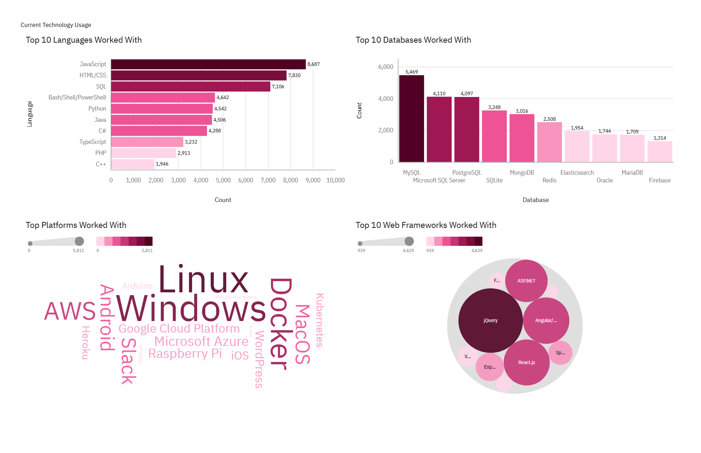
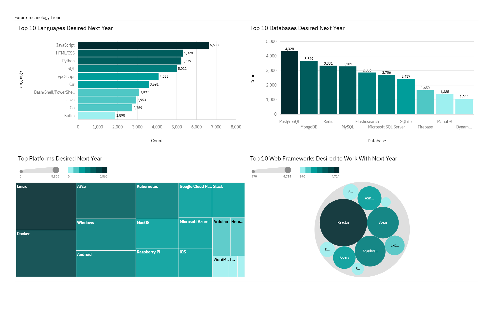
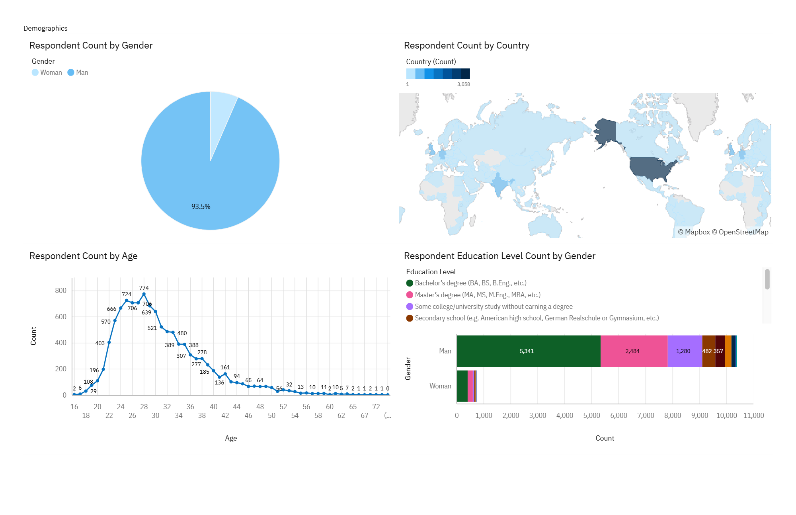

# Developer Trends Analysis (Stack Overflow Dataset)

## Overview
This project analyzes global developer trends using data from the Stack Overflow Developer Survey, along with additional data sources such as job postings and salary data.

The goal is to identify patterns in technology usage, developer preferences, and industry demand.

---

## Data Sources
- Stack Overflow Developer Survey (2019)
- GitHub Jobs API (modified dataset)
- Salary data (web scraping)

---

## Tools Used
- IBM Cognos (data visualization & dashboards)
- Excel (data preparation)
- SQL (data querying)

---

## Key Analysis Areas
- Programming language trends
- Database technology trends
- Developer demographics
- Job preference factors

---

## Key Insights

### Programming Languages
- JavaScript remains the most widely used and desired language
- Python is rapidly increasing in demand
- Interest in Bash/Shell scripting is declining

### Databases
- NoSQL databases (e.g., MongoDB, DynamoDB) are growing in popularity
- Relational databases remain widely used
- PostgreSQL is gaining traction
- Interest in Microsoft SQL Server is decreasing

### Developer Insights
- Majority of respondents are aged 22–32
- Most respondents are from developed, English-speaking countries
- The most important job factor is the technologies used

---

## Conclusion
Developers tend to prefer:
- Simple and easy-to-use technologies
- Tools with less complexity
- Technologies that reduce errors (e.g., strongly typed languages)

---

## Dashboards

### Dashboard 1

### Dashboard 2

### Dashboard 3

---

## Project Status
This project was developed as part of a data analysis capstone. The dashboards and analysis are complete and demonstrate practical data analysis and visualization skills.
